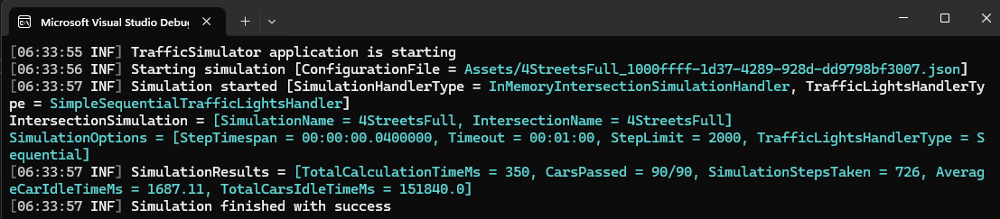
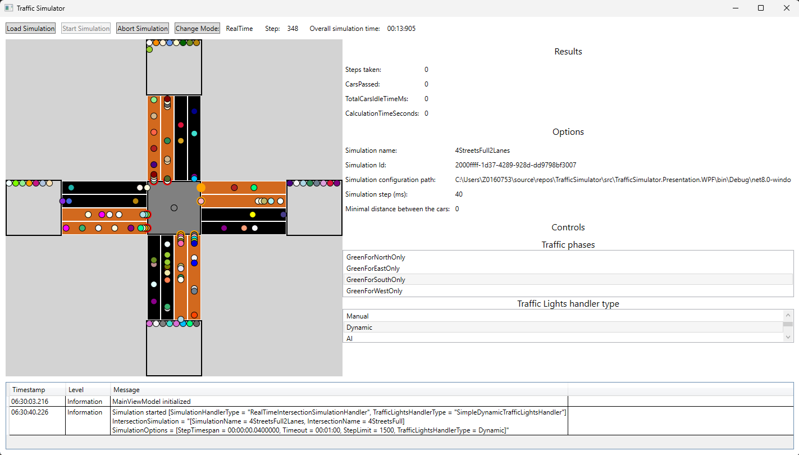

# TrafficSimulator

**TrafficSimulator** is a hobby project designed to explore how much more effective AI-based traffic control can be compared to traditional sequential systems at managing a single intersection.

## Project Assumptions (Ubiquitous Language)

- The geometry of an intersection is parameterized and fully configurable.
- Each inbound lane can have a car generator assigned to it.
- Multiple types of car generators are supported, producing cars at varying intensities over time.
- A car starts from an inbound lane, passes through the traffic light and intersection core, and exits via an outbound lane.
- A car stops at a red traffic light.
- A car proceeds at a green traffic light.
- Cars have inertia, causing them to accelerate and decelerate gradually.
- Car length and the minimum distance between cars are configurable.
- Cars pass through the intersection as quickly as possible.
- After reaching the end of an outbound lane, a car is moved to a parking area.
- The simulation ends when one of the following conditions is met:
  - A timeout is reached.
  - The maximum number of simulation steps is reached.
  - All car generators have finished producing cars and all cars have reached parking.

- Simulation results include:
  - Total simulation duration.
  - Number of computational steps performed.
  - Average and total idle time (i.e., time cars spend stuck in traffic).

## Project Structure

The project follows the principles of **Clean Architecture**, with separate layers for Domain, Application, and Infrastructure.  
There are two presentation layers:
- **Console**
- **WPF**

## Console

In console mode, the simulator reads a provided configuration file and runs the simulation as fast as possible, printing results to the console.

## WPF

Provides a basic graphical representation of the intersection simulation.  
(*Note: The current UI is minimal and not visually polished.*)

## Limitations

1. There is no GUI for configuring a new intersection geometry or simulation parameters. This must currently be done via:
   - Unit tests (preferred):  
     [`JsonSimulationSetupRepositoryTests.cs`](test/TrafficSimulator.Infrastructure.UnitTests/SimulationSetup/Json/JsonSimulationSetupRepositoryTests.cs)
   - Or manually editing a text file.
2. The intersection core has fixed distance for all cars and car's travel through the intersection is not rendered in WPF application. When a car is on the intersection core it is moved to the center of the intersection core for as long as it is determined to be on an outbound lane. 

## To Do

1. Add support for multiple AI algorithms to control traffic lights:
   - NEAT
   - (Additional AI models to be added)
2. Implement a continuous simulation mode to support reinforcement learning, where a neural network is trained until it reaches a target reward function (fitness) value.

## License

This project is licensed under the **MIT License**.